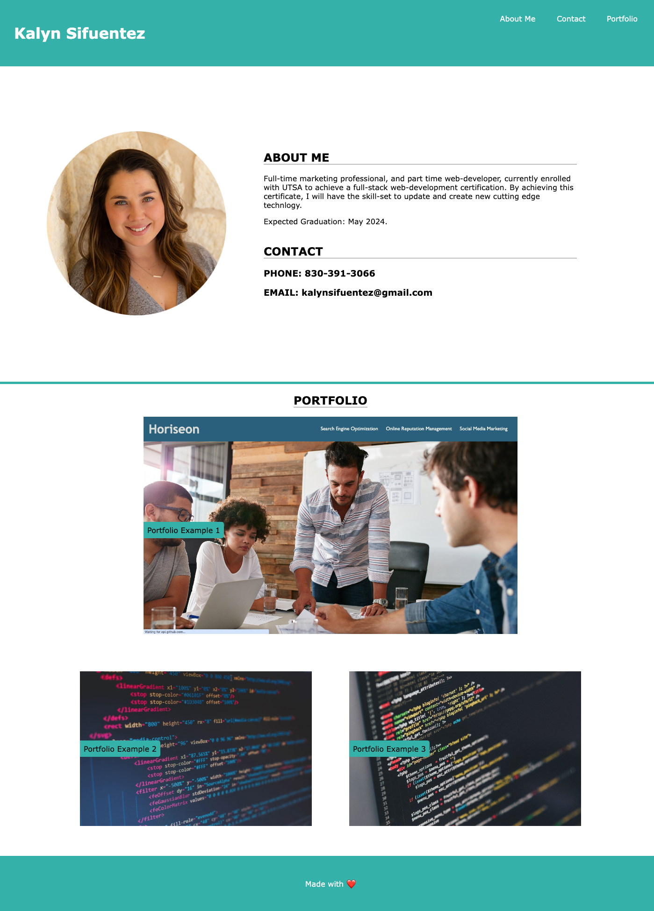

# Challenge 2 - My Portfolio Page

## Description

Designed web page to access my most recent web editing accomplishments complete with photos and links to to access those URL's. The main section includes a photo of myself, a blurb about myself and how to contact me. The menu navigates to the corresponding sections including my portfolio. The most recent web application in my portfolio is larger than other the examples available. Flexbox was used in my code, so this web application is responsive when the page is resized.

## Code Source 

HTTPS GitHub Repository: https://github.com/kalynsifuentez/challenge-1.git

Live URL: https://kalynsifuentez.github.io/portfolio-page/

## Screenshot 